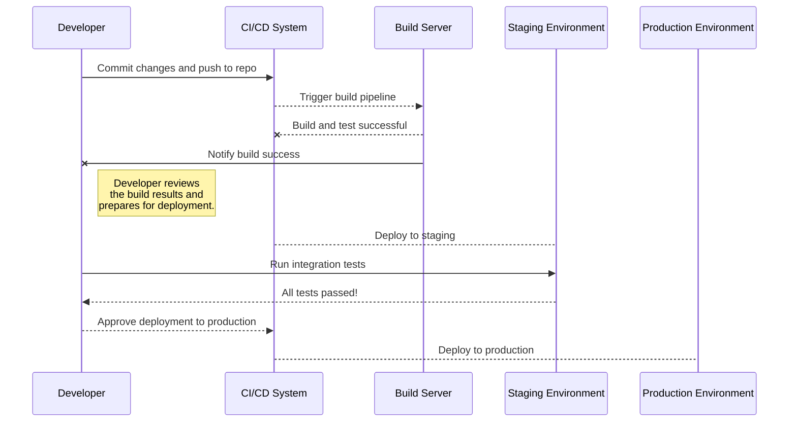
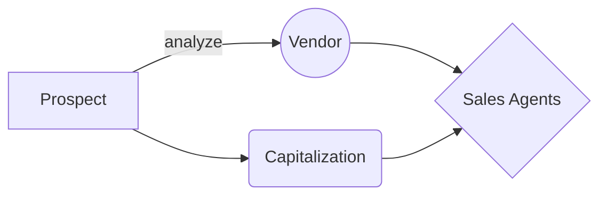

# project-hub
Project Hub is a centralized repository designed to streamline the management and development of your professional projects.

😀
=======
#Features

Modular Architecture: Clean separation of concerns with a well-structured codebase.
Comprehensive Documentation: Detailed guides and references for developers and stakeholders.
Automated Testing: Robust testing framework for unit, integration, and end-to-end tests.
CI/CD Integration: Continuous integration and deployment pipelines for streamlined development.
Environment-Specific Configurations: Easily switch between different environments (development, staging, production).

## Diagram

Recommended **flow chart** :

